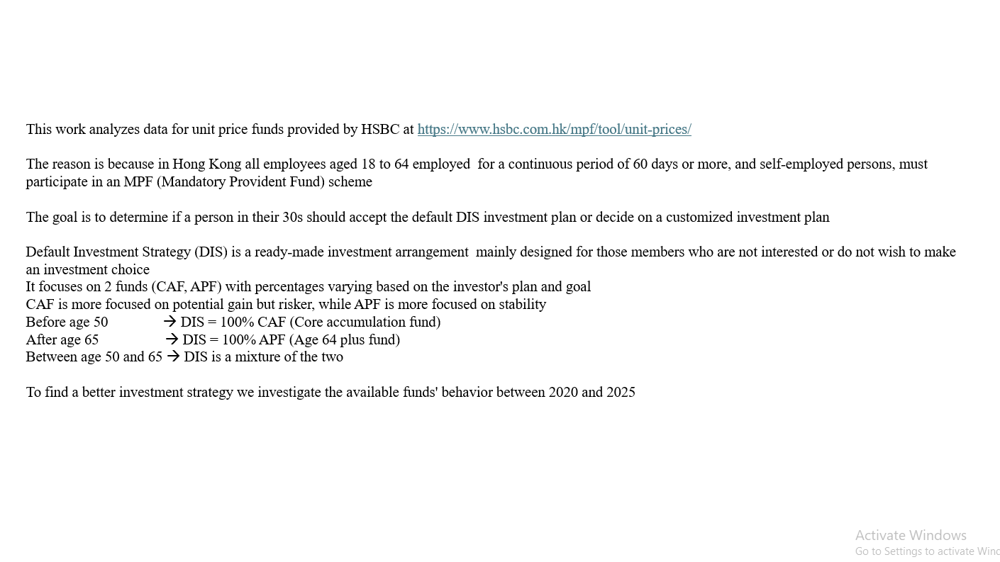
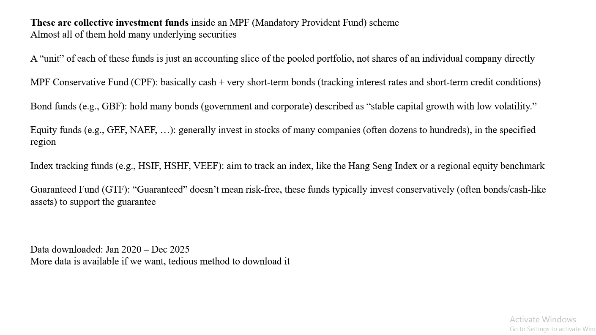
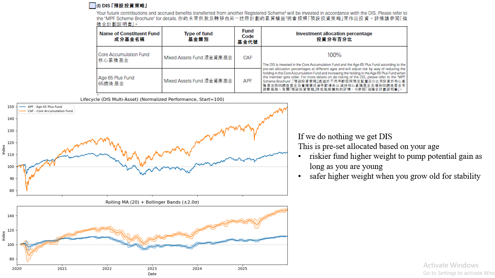
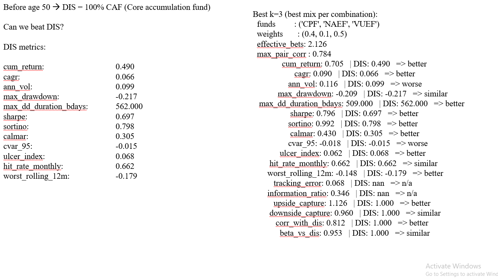
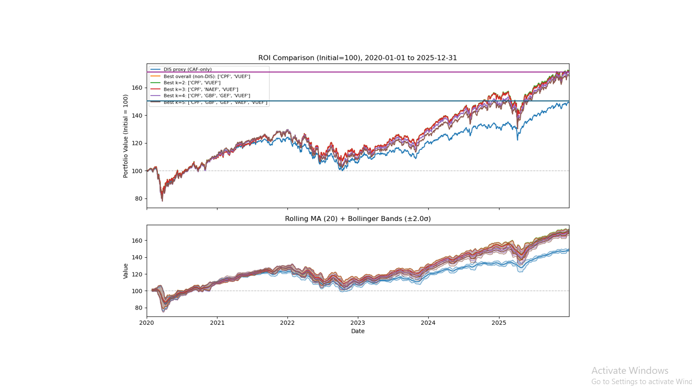

# HSBC MPF Unit Price Analysis: Can a Custom Portfolio Beat DIS?

This repo is a small research project on **Hong Kong MPF (Mandatory Provident Fund)** options using **HSBC MPF unit price data**.

The question is simple (and very human):  
> If you're in your 30s, should you just accept the default **DIS** glidepath, or can you build a *better* buy-and-hold mix from the available funds?

This project uses historical unit prices (2020–2025, with optimization over 2022–2025) to compare a **DIS proxy** against a grid-searched set of long-only portfolios.

**Files**
- `fund_analysis.py`: original analysis script  
- `mpf_results.pptx`: presentation summarizing results  
- `fund_analysis_clean.py`: cleaned-up version of the script (same logic, clearer structure)

---

## Background

### MPF in Hong Kong
In Hong Kong, most employees aged **18–64** employed for **60 days or more** (and self-employed persons) must participate in an MPF scheme.

### What is DIS?
**Default Investment Strategy (DIS)** is a ready-made investment arrangement for members who don't choose funds themselves. It focuses on two HSBC funds:

- **CAF**: Core Accumulation Fund (growth-oriented, riskier)
- **APF**: Age 65 Plus Fund (more conservative, stability-oriented)

**Simplified glidepath**
- Before age 50: **~100% CAF**
- After age 65: **~100% APF**
- Between 50 and 65: mix of CAF/APF that shifts with age

In this repo we use a **DIS proxy for a ~35 year-old**: **100% CAF**.

---

## Data

**Source:** HSBC MPF unit price tool (manual CSV downloads):  
`https://www.hsbc.com.hk/mpf/tool/unit-prices/`

**Time window available in the dataset used here:** `2020-01-01` to `2025-12-31`.

> Note: more history exists, but downloading it is manual/tedious with the current workflow.

---

## What the script does

### A) Data engineering
- Merges partial downloads per fund code (e.g. `VEEF_1.csv`, `VEEF_2.csv` → `VEEF.csv`)
- Sorts chronologically, drops duplicate dates
- Filters to a configured window (`X_START..X_END`)
- Writes one clean CSV per fund into an output folder

### B) Visualization
For each fund group:
- **Top panel:** normalized performance index (starts at 100)
- **Bottom panel:** moving average + Bollinger bands

It also plots ROI series for DIS vs selected portfolios.

### C) Portfolio search (grid search over weights)
**Goal:** find long-only, buy-and-hold mixes that *beat DIS historically* while staying “close enough” on risk.

- Optimization window (as used in the presentation): **2022–2025**
- Long-only weights, sum to 1.0
- Grid step (default): `0.1`
- Minimum per-fund weight (default): `0.1`
- Maximum funds in portfolio (default): `5`

### Rulebook: what counts as “better than DIS”
**Hard filters**
1. **Return:** `cum_return(port) > cum_return(DIS)`
2. **Risk budget (with slack):**
   - `ann_vol(port) <= ann_vol(DIS) + VOL_SLACK`
   - `max_drawdown(port) >= max_drawdown(DIS) - MDD_SLACK`  
     (drawdown is negative, so “>=” means “not worse”)
3. **Avoid fake diversification**
   - Discard combinations with too-high pair correlation
   - Discard combos with low **effective number of bets** (ENB), computed from correlation eigenvalues

**Ranking (tie-break among survivors)**
- Primary: maximize `cum_return`
- Then: prefer better risk shape (Calmar, Sortino), better tail risk (CVaR), lower ulcer index, shorter drawdowns, better upside/downside capture vs DIS (when available).

---

## Key results (from the presentation)

DIS proxy metrics (CAF-only, aligned window) include:  
`cum_return 0.490`, `CAGR 0.066`, `ann_vol 0.099`, `max_drawdown -0.217`, Sharpe `0.697`.

Best mixes reported (examples):
- **k=2:** `('CPF', 'VUEF')` weights `(0.4, 0.6)`  
  `cum_return 0.711` vs DIS `0.490` (better), Sharpe `0.786` vs `0.697` (better), but volatility `0.119` vs `0.099` (worse).
- **k=3:** `('CPF', 'NAEF', 'VUEF')` weights `(0.4, 0.1, 0.5)`  
  Similar headline return improvement with slightly different risk/shape.
- **k=4:** `('CPF', 'GBF', 'GEF', 'VUEF')` weights `(0.2, 0.1, 0.4, 0.3)`
- **k=5:** `('CPF', 'GBF', 'GEF', 'VAEF', 'VUEF')` weights `(0.2, 0.1, 0.2, 0.1, 0.4)`

---

## How to run

### 1) Install dependencies
```bash
pip install -r requirements.txt
```

### 2) Download the CSV files
Download fund unit price CSVs from the HSBC tool and place them in a single directory. The script expects filenames like:
- `VUEF_1.csv`, `VUEF_2.csv`, ...
- `CAF_1.csv`, ...
- etc.

### 3) Run
Cleaned script version (recommended):
```bash
python fund_analysis_clean.py --input-dir "/path/to/mpf_csvs" --output-dir "./merged"
```

If you want to keep it exactly as originally written:
```bash
python fund_analysis.py
```

### Outputs
- `./merged/<FUND>.csv` cleaned per-fund files
- `./merged/grid_search_results.csv` best-per-combination search results
- Plots displayed interactively (matplotlib windows)

---

## Assumptions and limitations (aka: the fine print nobody reads)

- **Not financial advice.** It's a historical backtest with a lot of assumptions.
- The DIS proxy is simplified (CAF-only for “30s”). Real DIS allocation depends on exact age and scheme rules.
- No fees, contributions, taxes, switching constraints, or rebalancing schedules are modeled.
- Grid-search resolution is coarse (`0.1` step) by design.

---

## License
Add whatever license you want. Humans love arguing about this.

## Screenshots (from `mpf_results.pptx`)

These are direct screenshots from the accompanying results deck.










